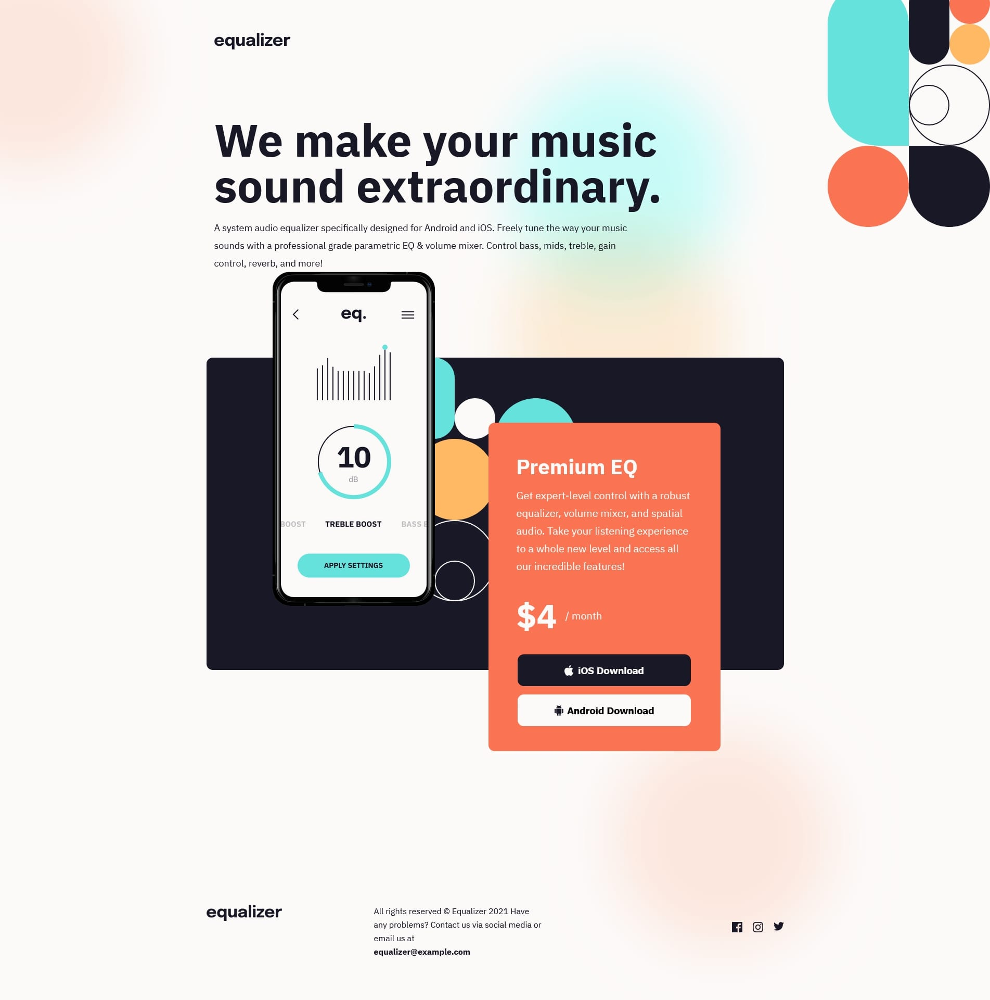

# Frontend Mentor - Equalizer landing page solution

This is a solution to the [Equalizer landing page challenge on Frontend Mentor](https://www.frontendmentor.io/challenges/equalizer-landing-page-7VJ4gp3DE).

## Table of contents

- [Overview](#overview)
  - [The challenge](#the-challenge)
  - [Screenshot](#screenshot)
  - [Links](#links)
- [Author](#author)

## Overview

### The challenge

Users should be able to:

- View the optimal layout depending on their device's screen size
- See hover states for interactive elements

### Screenshot

### Links

- Live Site URL: [Equalizer landing page](https://ekizashvilit.github.io/equalizer-landing-page/)

## Author

- LinkedIn - [Teona Ekizashvili](https://www.linkedin.com/in/teona-ekizashvili-ba5725239/)
- Twitter - [@ekizashvilit](https://twitter.com/ekizashvilit)
